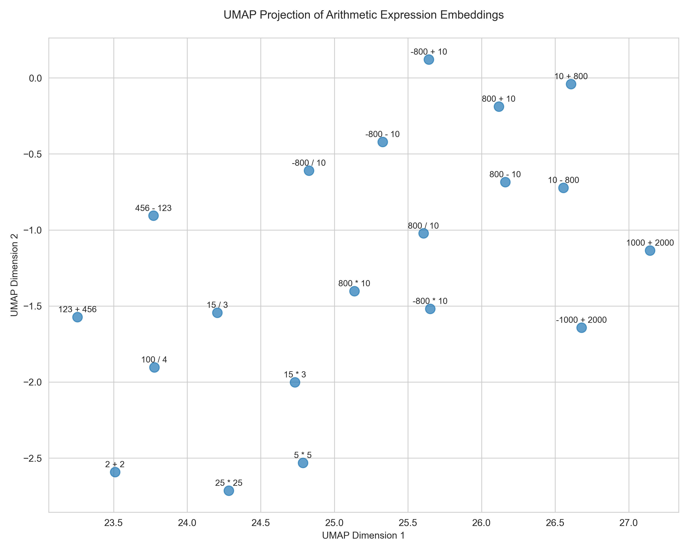

# Assessing Reasoning Potential of Semantic Embedding Models with SFT and PPO

**→** A controlled experiment testing whether Cohere's semantic embeddings enable arithmetic reasoning when augmented with lightweight transformer layers. **Implemented from scratch in PyTorch with both SFT and PPO training.**

## Key Question

Can frozen semantic embeddings (trained for similarity tasks) serve as useful inputs for autoregressive reasoning when combined with:

1. A small transformer decoder trained via **SFT**?
2. The same model fine-tuned with **RLHF (PPO)**?

I specifically:

- Use **precomputed Cohere's `embed-v4.0` embeddings** of math questions
- Train a Transformer decoder to generate answers digit-by-digit
- Evaluate the decoder’s capacity to “reason” from dense input embeddings

Both SFT and PPO training methods are written **from scratch**.

## Motivation

I am exploring how pre-trained semantic embeddings (like those from Cohere) can be leveraged in a post-training pipeline to fine-tune a language model for simple arithmetic reasoning tasks (SFT, RLHF). My goal is to understand whether these embeddings, usually trained for similarity or classification tasks, contain enough contextual information to guide fine-tuning for such a task.

From this diagram, which plots embeddings of math operations,the embeddings evidently seem to be clustered based on the numbers being used, and are also separated based on the operator (add, subtract, etc.), which shows potential in training an external model to understand the embeddings for this task.

## Model Overview

- **Input:** A fixed-size embedding (e.g., 256-dim vector) representing a math question (e.g. ` What is 9 + 10?`)
- **Output:** A sequence of digits representing the numerical answer + end token
- **Architecture:** Transformer decoder with token embeddings for digits `0–9`, producing results in an autoregressive fashion.

## Current Progress

Currently writing the training loops for both PPO and SFT. Will soon be testing both models and releasing my results

## Next Steps

- **More complicated Math Arithmetic**: Extend to multi-step problems (e.g., "(12 + 3) \* 4")
- **Extension to Other Tasks with Curriculum-Based Learning:** Generalize approach to other reasoning tasks or datasets, such as logical inference or multi-step word problems.
